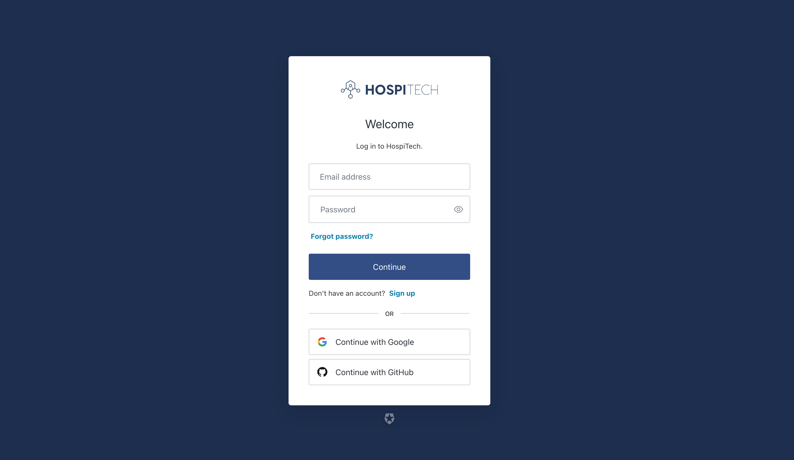
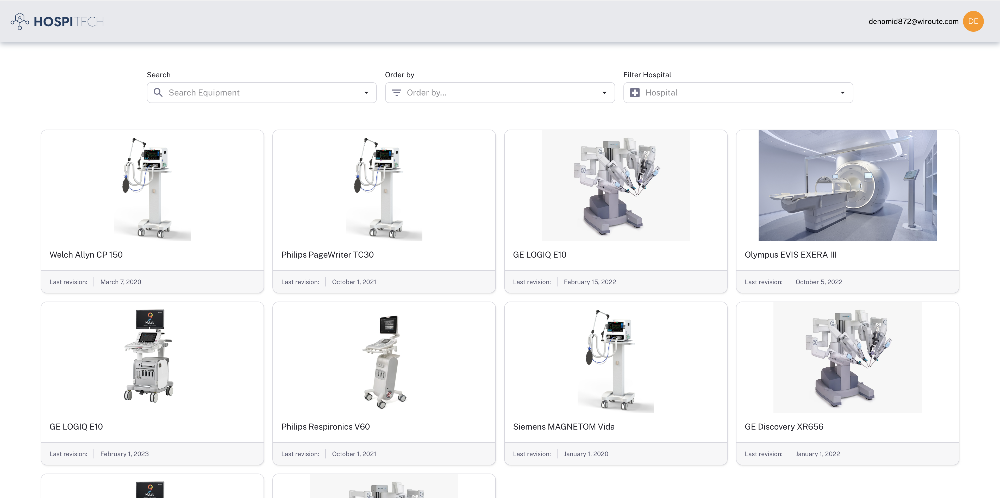
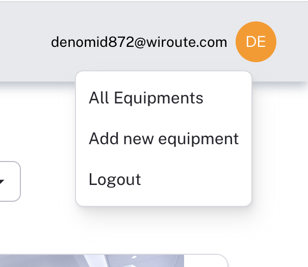
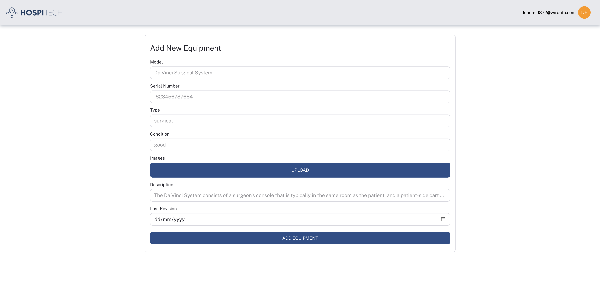

# HospiTech

<div>
  <p align="center">
     
  </p>
</div>

HospiTech connects hospitals that have excess or unused medical equipment with hospitals that need it, particularly those with limited resources. It aims to reduce waste and ensure that medical equipment is put to good use by facilitating the redistribution of equipment between hospitals.

## Overview

1. Create an account: The first step is to create an account on the app. This will involve providing some basic personal information and selecting the hospital you belong to from a list of registered hospitals.
2. Access the equipment list: Once you have created an account and logged in, you will have access to a list of all the medical equipment that is available for donation or exchange. You can filter this list based on your preferences and needs.
3. Add new equipment: If you have medical equipment that you want to donate or exchange, you can add it to the list by providing details such as the type of equipment, its condition, and the hospital it belongs to.

<div>
  <p align="center">
    
    
    
    
    
  </p>
</div>

## Getting Started

### Prerequisites

- npm
- Node.js
- PostgreSQL

### Installation

1. Clone the repository:

```sh
   git clone https://github.com/JoaquinBuxo/HospiTech.git
```

2. Install dependencies:

- Client : `cd client`

  ```sh
  npm install
  ```

- Server : `cd server`

  ```sh
  npm install
  ```

3. Setup env variables:

- Client: `cd client` & `touch .env`

  ```sh
  VITE_API_SERVER_URL='yourServerURL'
  ```

- Server: `cd server` & `touch .env`

  ```sh
  DATABASE_URL="postgresql://..."
  CLOUDINARY_NAME=
  CLOUDINARY_API_KEY=
  CLOUDINARY_API_SECRET=
  ```

4. Setupo and start the app:

- Client: `cd client`

```sh
npm run dev
```

- Server: `cd server`

```sh
"Warning: At this moment, you will need to manually add at least one hospital to the database in order for the app to function properly."
```

```sh
npm start
```
